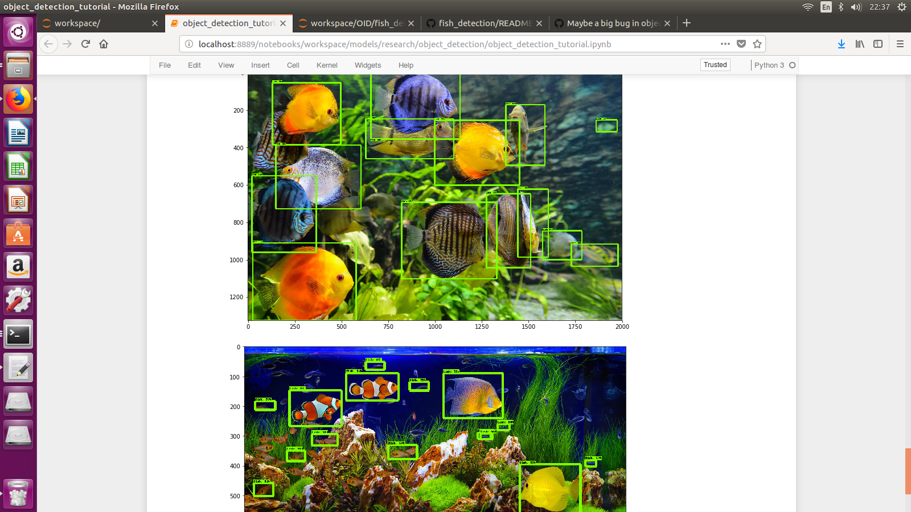
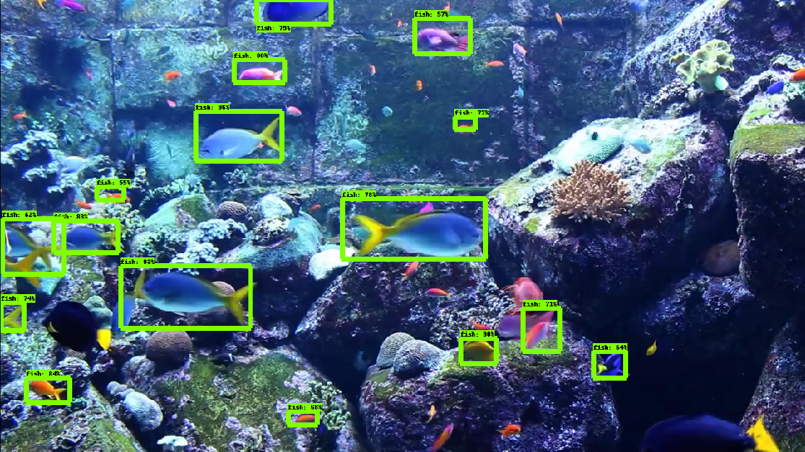
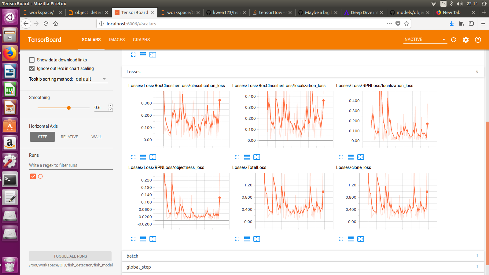
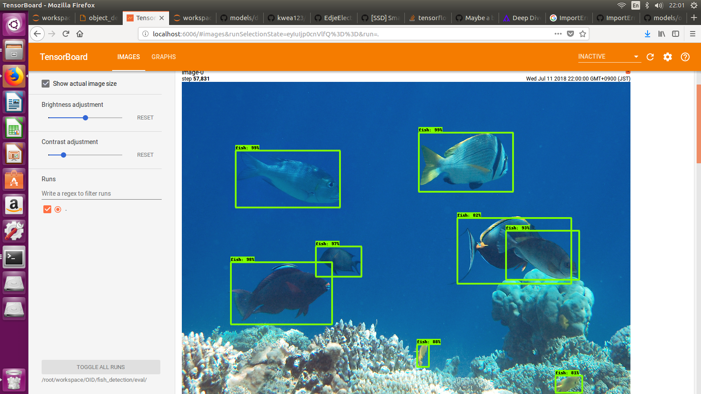

# fish_detection

This repository contains a tutorial of fish detection using Open Images Dataset and Tensorflow Object Detection.

Here is the final result (using googled images):


And a youtube video :

[](https://www.youtube.com/watch?v=KkJQ6qUoEPk)

For people who just want to use my pretrained weights, you only have to do [1. Setup Tensorflow Object Detection API](https://github.com/kwea123/fish_detection#1-setup-tensorflow-object-detection-api) and [9. Run inference](https://github.com/kwea123/fish_detection/blob/master/README.md#9-run-inference).

# Prepare data

The [Open Images Dataset](https://storage.googleapis.com/openimages/web/index.html) is downloadable from [cvdfoundation](https://github.com/cvdfoundation/open-images-dataset#download-images-with-bounding-boxes-annotations), of size 513GB. It took around 13 hours with 10MB/s network speed.

Download all the images along with the annotations.

Clone this repository with `git clone https://github.com/kwea123/fish_detection.git`.

# Setup the environment

The OS is ubuntu-16.04.

A `Dockerfile` with all dependencies is provided. You can build it with
```
docker build -t $CONTAINER:$TAG ./
```

This may take a while on the first build.

Otherwise, an environment with all dependencies also works.

# Examine the data

## Check and extract data

To check how the data format looks like, see [read_test.ipynb](https://nbviewer.jupyter.org/github/kwea123/fish_detection/blob/master/read_test.ipynb).

Since we only want to train on fish (and related species), use [read_fish.ipynb](https://nbviewer.jupyter.org/github/kwea123/fish_detection/blob/master/read_fish.ipynb) to see how much data we actually have.

Among all images, there are `24403` individual fish bounding boxes training data.

Also, we save the minimum required data (ImageId and bounding box coordinates) into `fish_train.csv` and `fish_val.csv` (you can use the test set too).

# Choose an object detection model

I choose [Tensorflow Object Detection](https://github.com/tensorflow/models/tree/master/research/object_detection) to be my detection model.

## 1. Setup Tensorflow Object Detection API

Clone Tensorflow Object Detection github :
```
git clone https://github.com/tensorflow/models.git
```

Execute the following commands from `models/research/` :
```
protoc object_detection/protos/*.proto --python_out=. # protoc needs to be version 3
export PYTHONPATH=$PYTHONPATH:`pwd`:`pwd`/slim # needs to be executed each time in a new shell
```
Normally, `protoc` version 3 should be installed when you build the docker.
If not, refer to [this page](https://gist.github.com/sofyanhadia/37787e5ed098c97919b8c593f0ec44d8) and install it (`protoc` version 2 **doesn't work**).

If you forget to run them, you could get `ImportError: No module named deployment` or `ImportError: No module named object_detection` when training.

## 2. Prepare TFRecord

In order to train a tensorflow model, we need to prepare the data in its acceptable form, which are `tfrecord`s.

Following the official [tutorial](https://github.com/tensorflow/models/blob/master/research/object_detection/g3doc/using_your_own_dataset.md), I created [create_tfrecords.py](create_tfrecords.py) which converts the `.csv` files created in [read_fish.ipynb](https://nbviewer.jupyter.org/github/kwea123/fish_detection/blob/master/read_fish.ipynb) into `.record` files.

Run
```
python create_tfrecords.py --output_path data/fish_train.record --csv_input data/fish_train.csv --image_path=/root/data/images/train/
```
with the paths set correctly to your paths.

## 3. Create the label map

From `/models/research/object_detection/data`, you can see sample label maps.

Create your own according to your classes. E.g. mine is [fish_label_map.pbtxt](data/fish_label_map.pbtxt)

**Note** : The class id must start from **1**.

Now the data prepartion is completed. We move on to prepare the model.

## 4. Download an existing model

Download a model from [Tensorflow detection model zoo](https://github.com/tensorflow/models/blob/master/research/object_detection/g3doc/detection_model_zoo.md), and extract the `.tar` file.

I use [faster_rcnn_inception_v2_coco](http://download.tensorflow.org/models/object_detection/faster_rcnn_inception_v2_coco_2018_01_28.tar.gz) since it's fast and enough accurate.

**Note** : I had difficulty obtaining good results using ssd nets.
See [Issue](https://github.com/tensorflow/models/issues/3196) for more information.

## 5. Pick the corresponding config

Pick the model's config from `/models/research/object_detection/samples/configs`. Duplicate it somewhere.

**Note** : you must pick the config with the **same** name as your model.

## 6. Modify the config

Open the duplicated config, (change its name if you wish) and modify the following according to your model:

* `num_classes`, which should be at the beginning of the file;
* `fine_tune_checkpoint` and
* 
```
train_input_reader: {
  tf_record_input_reader {
    input_path: "PATH_TO_BE_CONFIGURED/mscoco_train.record"
  }
  label_map_path: "PATH_TO_BE_CONFIGURED/mscoco_label_map.pbtxt"
}

eval_config: {
  num_examples: 8000
  # Note: The below line limits the evaluation process to 10 evaluations.
  # Remove the below line to evaluate indefinitely.
  max_evals: 10
}

eval_input_reader: {
  tf_record_input_reader {
    input_path: "PATH_TO_BE_CONFIGURED/mscoco_val.record"
  }
  label_map_path: "PATH_TO_BE_CONFIGURED/mscoco_label_map.pbtxt"
  shuffle: false
  num_readers: 1
}
```
which are towards the end of the file.

**Note** : The paths should be **absolute**!

You can refer to [my configuration](faster_rcnn_inception_v2_coco.config).

## 6. Start training

You can start training now!

From `models/research/`, run
```
python object_detection/legacy/train.py --logtostderr --train_dir=${YOUR MODEL'S OUTPUT DIR} --pipeline_config_path=${YOUR CONFIG's PATH} 
```
**Note** : The paths should be **absolute**!

You will get the following training info :
```
...
INFO:tensorflow:global step 31303: loss = 0.1623 (0.109 sec/step)
INFO:tensorflow:global step 31304: loss = 0.2365 (0.111 sec/step)
...
```

Your model is on the way!

You can run `tensorboard --logdir=${YOUR MODEL'S OUTPUT DIR}` to check if the loss actually decreases.

You should see an image like the following :


**Important note** : You need to constantly keep track of the loss. It will decrease at the beginning and at some time starts to re-increase. You had better *stop* training at this point (early-stopping). In my case, training for 200k steps (as default) gives me bad results (many missed detections), whereas stopping at around 50k steps (where the loss is minimal) gives me lots of true positives.

## 7. See validation set results

From `models/research/`, run
```
python object_detection/legacy/eval.py --logtostderr --checkpoint_dir=${YOUR MODEL'S OUTPUT DIR} --pipeline_config_path=${YOUR CONFIG's PATH} --eval_dir=${YOUR EVAL'S OUTUPT DIR} 
```

In case a `Syntax Error` appears on `print`, modify `models/research/object_detection/utils/object_detection_evaluation.py#L842` by adding parentheses for these 3 `print`s.

Then, run `tensorboard --logdir=${YOUR EVAL'S OUTUPT DIR}`. 

You should see some validation images like the following :


## 8. Export the graph

Once your model is trained, you need to export a `.pb` graph, to use for inference.

From `models/research/`, run
```
python object_detection/export_inference_graph.py --input_type image_tensor --pipeline_config_path ${YOUR CONFIG's PATH} --trained_checkpoint_prefix ${YOUR MODEL'S OUTPUT DIR}/model.ckpt-XXXX --output_directory ${YOUR GRAPH's PATH}
```
where `XXXX` is the last checkpoint step (the largest number in that folder).

## 9. Run inference

First, find some images with objects you want to detect inside (in my case fish). Download them to `models/research/object_detection/test_images` with format `imageX.jpg`, where X is a number, starting from `3` (since there are already two test images by default).

Move the folder containing the `.pb` graph to `/models/research/object_detection/`, and copy the label map to `/models/research/object_detection/data/`.

Open `models/research/object_detection/object_detection_tutorial.ipynb`.

Modify the "Model preparation" cell where the `MODEL_NAME`, `PATH_TO_LABELS`, and `NUM_CLASSES` are set (set to your values).
Modify the "Detection" cell, set `TEST_IMAGE_PATHS` correctly (increase the `range`).

Execute the cells from the top to the bottom, skipping the "Download model" cell.

You can see your detection result, which should be comparable to mine at the beginning of this readme!

More results are available at [results.ipynb](https://nbviewer.jupyter.org/github/kwea123/fish_detection/blob/master/results.ipynb). The detection threshold is 0.1 and the output numbers are the detection time (in seconds) for each image.

My trained model is available [here](fish_inception_v2_graph/). You only need this graph and the [label map](data/fish_label_map.pbtxt) to be able to reproduce my result.

Finally, as for the speed, it runs at 40-50ms per image on one 1080Ti (after warmed up), which is sufficiently fast for me.

# Errors I encountered

To make your debug faster, I list some of the errors I met during training and the solutions :

*  [ValueError: Tried to convert 't' to a tensor and failed. Error: Argument must be a dense tensor: range(0, 3) - got shape [3], but wanted []](https://github.com/EdjeElectronics/TensorFlow-Object-Detection-API-Tutorial-Train-Multiple-Objects-Windows-10/issues/11)

*  [train.py error: InvalidArgumentError (see above for traceback): assertion failed: [Groundtruth boxes and labels have incompatible shapes!] [Condition x == y did not hold element-wise:] [x (Loss/BoxClassifierLoss/strided_slice_1:0) = ] ](https://github.com/tensorflow/models/issues/2737)

* [Tensorflow Failed to create Session](https://github.com/tensorflow/tensorflow/issues/9549)

# Other useful tutorials

Here are the tutorials I followed :

[How To Train an Object Detection Classifier Using TensorFlow 1.5 (GPU) on Windows 10](https://www.youtube.com/watch?v=Rgpfk6eYxJA)
